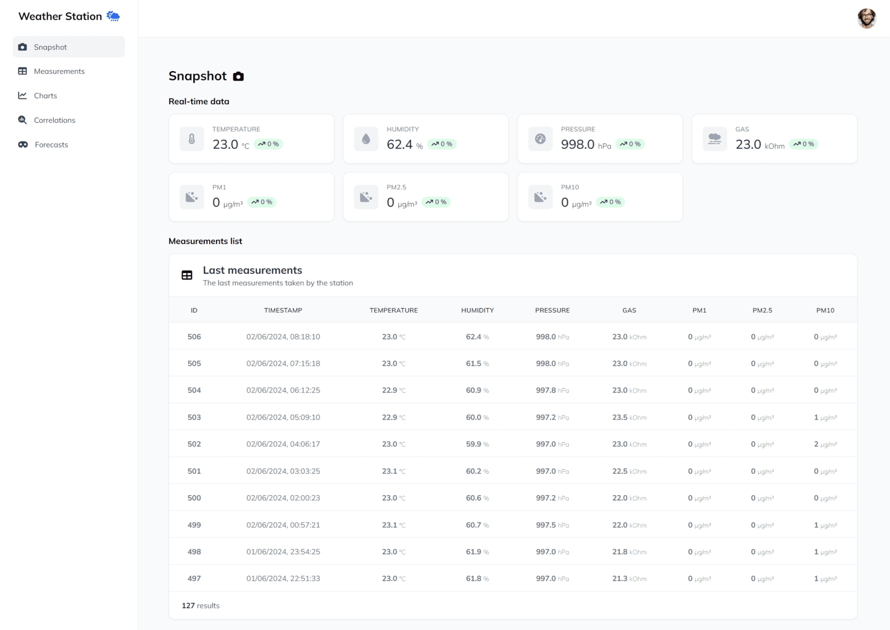
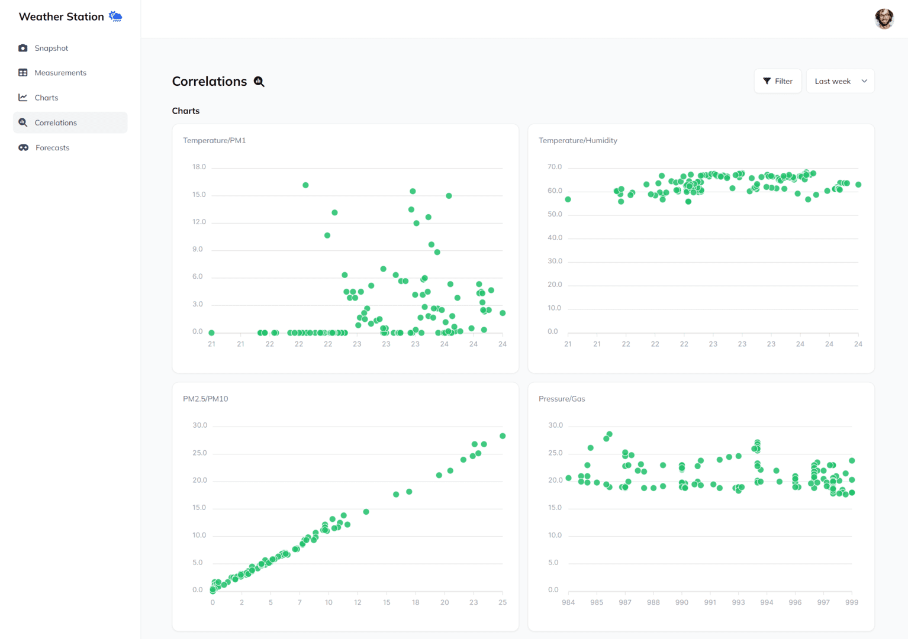
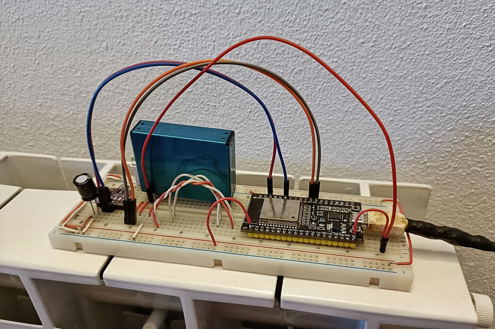

# Weather Station 🌤️

A very simple yet powerful weather station built using the ESP32 microcontroller.

# The Project

This `GitHub project` showcases a simple weather station powered by an `ESP32 microcontroller`, dedicated to monitoring environmental conditions such as temperature, humidity, pressure, gas, and particulate matter levels. The station utilizes a `BME680` sensor to read temperature, humidity, pressure, and gas levels, and a `PMS7003` sensor to measure PM1, PM2.5, and PM10 particulate matter concentrations.

The `ESP32` collects this comprehensive environmental data and transmits it to a `Node.js server` using the `MQTT protocol`, ensuring real-time data communication and efficient handling of sensor data. The server processes this data and stores it in a `MySQL database`, providing robust data storage and retrieval capabilities.

To make the data easily accessible and user-friendly, a web application is developed using `Vue.js` and `Tailwind CSS`. Vue.js, a progressive `JavaScript framework`, is utilized for creating an interactive and dynamic user interface, while `Tailwind CSS` enhances the app's responsiveness and aesthetic appeal, ensuring it works seamlessly across different devices and screen sizes. Users can view the latest readings in real-time, benefiting from a well-designed, intuitive dashboard that highlights key environmental conditions monitored by the weather station.

This project not only demonstrates the integration of various technologies, from microcontrollers to cloud storage and web development frameworks, but also serves as a practical solution for individuals interested in home automation, environmental monitoring, or IoT projects! ❤️

Here's some pictures:

## The Web Interface

## The Weather Station Prototype

# Technologies

Here's a short list of some of the technologies utilized in this project:

## Frontend
- `Vue.js` (Framework)
- `Tailwind CSS`, `Preline` (Style)
- `ApexCharts.js` (Charts)

## Backend
- `Node.js` (Server)
- `Express` (Web server)
- `MySQL` (Database)
- `Knex.js` (Query creation)

## Station
- `ESP32` (Microcontroller)
- `BME680` (Temperature, humidity, pressure, and gas sensor)
- `PMS7003` (PM1, PM2.5, and PM10 sensor)
- `MQTT` (ESP32 to server communication)

## Hosting
- `GitHub` (Repository and CI/CD)
- `Aruba Cloud VPS` (Server hosting)